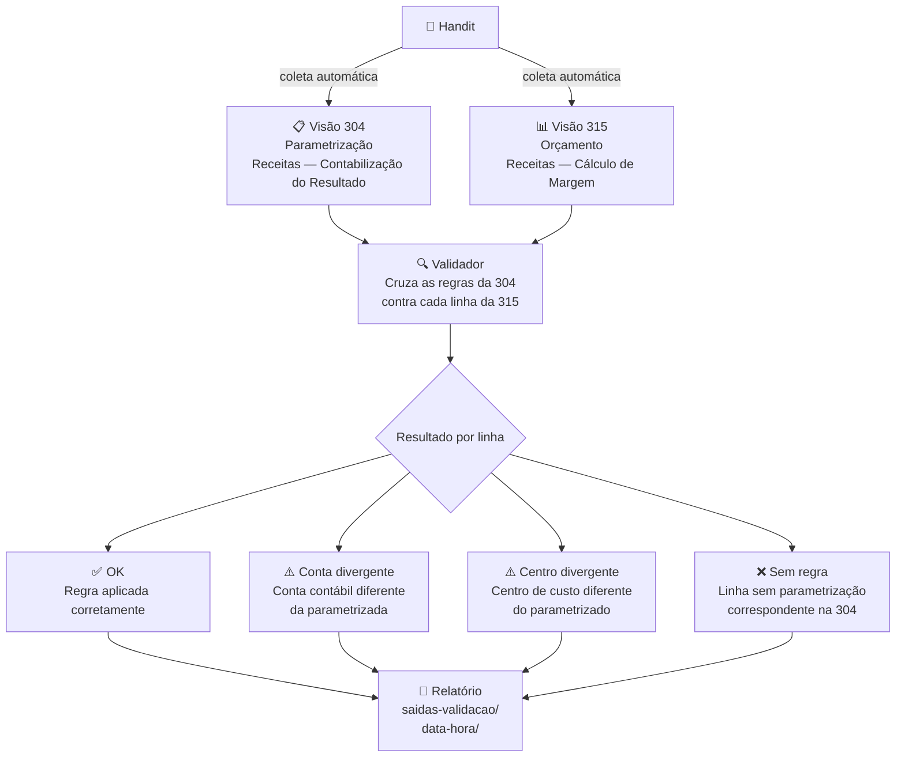

# Validador de Contabilização

> Automação inteligente para garantir que os valores orçados estejam sendo contabilizados corretamente no Handit.

---

## O que esse projeto faz

Empresas que utilizam o **Handit** para gestão orçamentária precisam garantir que os valores lançados no orçamento sigam as regras de contabilização definidas pela equipe de controladoria.

Esse projeto automatiza duas etapas que hoje são feitas manualmente:

1. **Coleta dos dados** — acessa o Handit automaticamente, exporta as visões necessárias e salva os arquivos organizados por data e hora.

2. **Validação das regras** — cruza os dados exportados e identifica onde os valores estão corretos e onde há divergências em relação ao que foi parametrizado.

---

## Qual problema resolve

Sem essa automação, um consultor ou analista precisaria:

- acessar manualmente cada visão no Handit
- exportar os arquivos um a um
- abrir as planilhas e cruzar os dados na mão
- identificar linhas com conta contábil ou centro de custo errado

Com esse projeto, tudo isso é feito em segundos — e com um relatório pronto ao final.

---

## As visões envolvidas

| Visão | Nome | Função |
|---|---|---|
| `304` | Receitas — Manutenção — Contabilização do Resultado | Define as **regras**: qual conta e centro de custo cada item do orçamento deve usar |
| `315` | Receitas — Orçamento — Cálculo de Margem | Contém o **orçamento detalhado** mês a mês, onde as regras devem estar aplicadas |

---

## Como funciona na prática



---

## O que é gerado ao final

Após cada execução, o projeto salva automaticamente uma pasta com data e hora contendo:

- **Relatório detalhado** — uma linha por registro analisado, com o status de cada um
- **Resumo por regra** — agrupado por conta, centro e tipo de divergência
- **Resumo geral** — totais de OK, divergentes e sem regra em formato estruturado

---

## Estrutura do projeto

```
📁 docs/           → documentação do fluxo e das decisões tomadas
📁 src/            → scripts de coleta e validação
📁 downloads/      → arquivos exportados do Handit
📁 saidas-validacao/ → resultados das execuções, organizados por data e hora
```

---

## Tecnologias utilizadas

| Ferramenta | Para que serve |
|---|---|
| **Playwright** | Acessa o Handit e exporta as visões automaticamente |
| **Node.js** | Executa os scripts de coleta e validação |
| **ExcelJS** | Lê os arquivos `.xlsx` exportados |

---

## Próximos passos

- [ ] Ampliar a validação para a visão `168 — Balancete — Acompanhamento — Por Conta`, verificando se os valores orçados chegam corretamente ao balancete contábil
