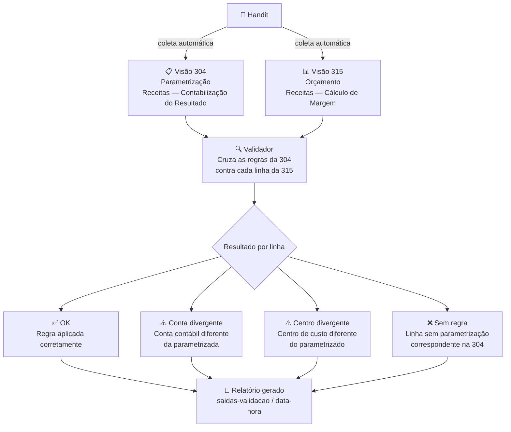

# Validador de Contabilização

> Automatiza a verificação de que os valores orçados no Handit estão sendo contabilizados nas contas e centros de custo corretos.

---

## O problema

Toda empresa que usa o Handit para orçamento precisa garantir que cada valor lançado siga as **regras de contabilização** definidas pela controladoria — ou seja, que o valor vá para a conta contábil e o centro de custo certos.

Hoje, verificar isso exige:

- abrir cada visão manualmente
- exportar planilhas uma por uma
- cruzar os dados no Excel
- caçar linha por linha onde algo está errado

**Esse trabalho pode levar horas — e ainda está sujeito a erro humano.**

---

## A solução

Este projeto faz tudo isso de forma automática:

| Etapa | O que acontece |
|---|---|
| **1. Coleta** | Acessa o Handit, exporta as visões e salva os arquivos organizados por data e hora |
| **2. Validação** | Cruza os dados e classifica cada linha como correta ou divergente |
| **3. Relatório** | Gera um arquivo pronto com todos os resultados da execução |

---

## As visões analisadas

**Visão 304 — Parametrização**
> Define as regras: para cada combinação de cenário, mercado e item de margem, qual deve ser a conta contábil e o centro de custo.

**Visão 315 — Orçamento**
> Contém o orçamento detalhado mês a mês. É aqui que as regras devem estar aplicadas corretamente.

---

## Como funciona

---

## O que vem no relatório

Ao final de cada execução, uma pasta com data e hora é criada automaticamente com três arquivos:

- **Detalhado** — cada linha do orçamento com seu status individual
- **Resumo por regra** — agrupado por conta, centro e tipo de divergência
- **Totais gerais** — quantos registros estão OK, divergentes ou sem regra

---

## Próximos passos

- [ ] Ampliar a validação para a visão `168 — Balancete — Acompanhamento — Por Conta`, confirmando que os valores orçados chegam corretamente ao balancete contábil
